- [CPU](#cpu)
  - [CPU Cache](#cpu-cache)
    - [Cache Line](#cache-line)
    - [直接映射](#直接映射)
    - [MESI协议](#mesi协议)
  - [CPU运行队列](#cpu运行队列)
  - [普通任务的优先级](#普通任务的优先级)
- [文件系统](#文件系统)
  - [基本组成](#基本组成)
  - [虚拟文件系统](#虚拟文件系统)
  - [文件存储](#文件存储)
    - [连续空间](#连续空间)
    - [非连续空间存储](#非连续空间存储)
  - [空间管理](#空间管理)
    - [空闲表法](#空闲表法)
    - [空闲链表法](#空闲链表法)
    - [位表法（🌟）](#位表法)
- [内存](#内存)
  - [虚拟内存](#虚拟内存)
    - [分段](#分段)
    - [分页](#分页)
    - [段页式](#段页式)
  - [TLB](#tlb)
  - [内存回收](#内存回收)
    - [分类](#分类)
      - [按同步和异步](#按同步和异步)
      - [按回收类型](#按回收类型)
    - [LRU算法](#lru算法)
    - [回收阈值](#回收阈值)
  - [内存空间分布](#内存空间分布)
    - [用户空间](#用户空间)
- [进程管理](#进程管理)
  - [进程状态](#进程状态)
  - [上下文切换](#上下文切换)
    - [PCB、TCB](#pcbtcb)
    - [轻量级进程](#轻量级进程)
  - [进程调度](#进程调度)
    - [调度原则](#调度原则)
    - [调度算法](#调度算法)
- [Linxu 命令](#linxu-命令)
  - [awk](#awk)


# CPU
## CPU Cache

### Cache Line

- 如右图所示：分为头标志和数据块两部分
- 头标志中包含：有效位，组标记

### 直接映射

流程：

- 通过内存地址中的索引计算得到→Cache Line索引；
- 判断有效位是否有效；
- 将内存地址的组标记和Cache Line的进行对比，若不是则直接访问内存；
- 根据内存的偏移量在Cache Line中读取对应的字


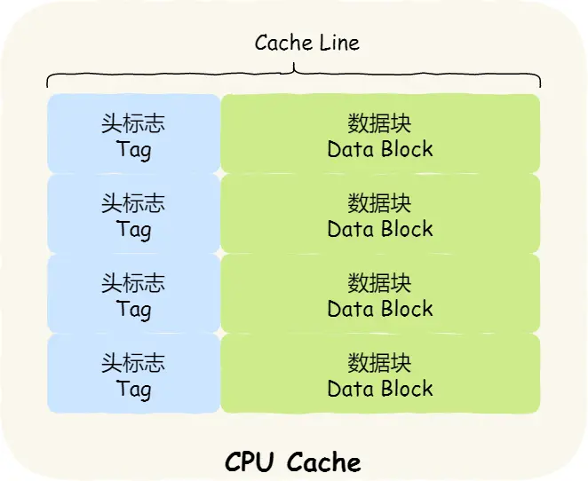


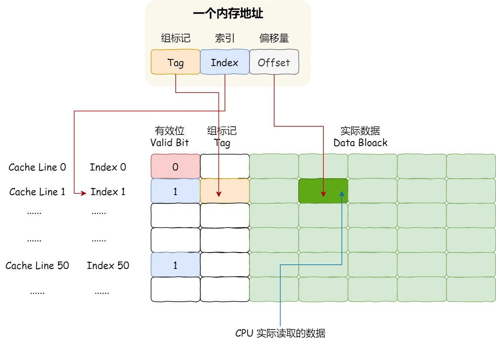

---

### MESI协议

包含四个状态，分别是：

- *Modified*，已修改：即dirty
- *Exclusive*，独占：该资源此线程的Cache独占
- *Shared*，共享：多个线程的Cache都有该资源
- *Invalidated*，已失效：保持该状态直到CPU再次调用

状态转移图如右图所示

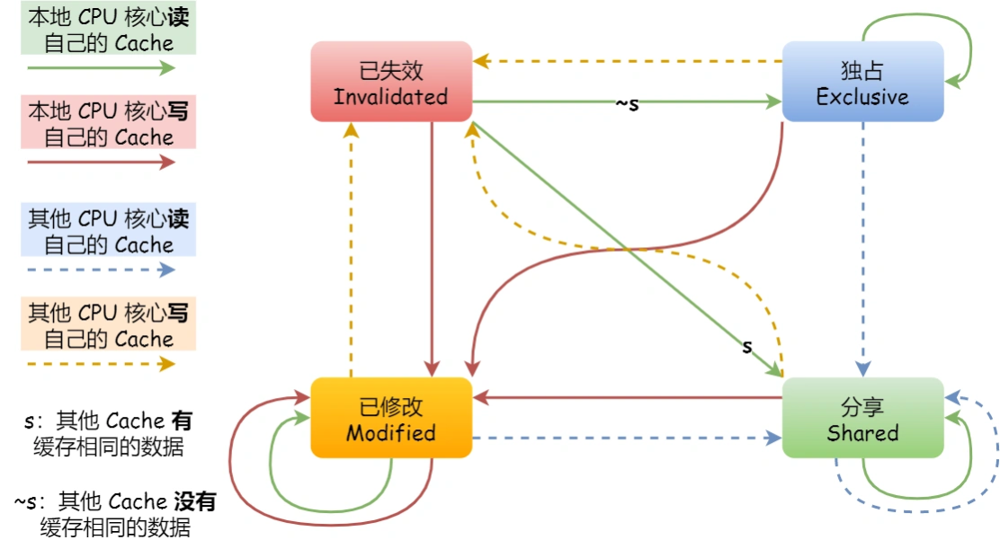


## CPU运行队列

每个CPU都有自己的运行队列（Run Queue, **rq**），包含了三种运行队列：（**优先级：dl_rq > rt_rq > cfs_rq**）

- Deadline运行队列dl_rq
- RealTime(**针对实时任务**)运行队列rt_rq
- **CFS**(Completely Fair Scheduling，**针对普通任务**)运行队列cfs_rq

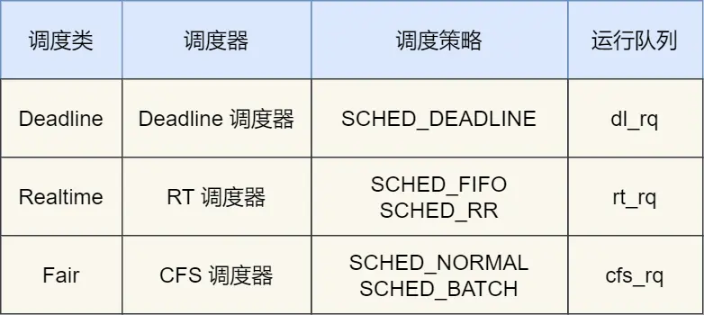

## 普通任务的优先级

优先级(priority)越小，优先级越高。priority的值：

- 0～99提供实时任务
- 100～139提供给普通任务（nice的值映射在此范围内）

`nice`值可以修改普通任务的优先级，取值范围为`-20～19`，即

$$
p_{new}=p_{old}+nice
$$


- 可以通过命令修改普通任务的nice值，以及更换调度策略

```bash
nice -n 3 /usr/bin/mysqld # 启动任务时设置nice
renice -10 -p <pid>	# 修改运行中普通任务的nice
chrt -f 1 -p 1996	# 修改调度策略为SCHED_FIFO，优先级为1
```

# 文件系统
## 基本组成

索引节点（*index node*）和目录项（*directory entry）*

- 索引节点：记录文件元信息，例如数据在磁盘位置、文件大小、访问权限、创建/修改时间等，是文件的唯一标识，存在**磁盘**中
- 目录项：记录文件名字、索引节点指针、与其他目录项的层级关系，由内核维护，缓存在**内存**中

## 虚拟文件系统

Virtual File System，**VFS**。因为文件系统种类繁多，VFS定义了一组所有文件系统都支持的数据结构和标准接口

文件系统通常分为三类：

- *网络的文件系统*，用来访问其他计算机主机数据的文件系统，比如 NFS、SMB 等等。
- *内存的文件系统*，这类文件系统的数据不是存储在硬盘的，而是占用内存空间，我们经常用到的 /proc 和 /sys 文件系统都属于这一类，读写这类文件，实际上是读写内核中相关的数据。
- *磁盘的文件系统*，它是直接把数据存储在磁盘中，比如 Ext 2/3/4、XFS 等都是这类文件系统。

## 文件存储

有连续空间存储和非连续空间存储两种方法

### 连续空间

- 需要提前知道文件的大小，以让文件头指定磁盘的起始位置和长度；
- 问题：「磁盘空间碎片」和「文件不易扩展」

### 非连续空间存储

**隐式连接**

- 每个数据块多出一块内存用于存储指针，链接下一个数据块，同时文件头包含「第一块」和「最后一块」的位置信息（以此确定起始位置和终止位置）。
- 存在的问题是**若中间有指针丢失，则后面的数据块都丢失**

**FAT**

File Allocation Table：文件分配表。属于「显示链接」，将用于链接文件各数据块的指针，显示的存放在内存的一张链表中，每个表中存放指向下一个数据号的指针（图见[这里](https://cdn.xiaolincoding.com/gh/xiaolincoder/ImageHost/%E6%93%8D%E4%BD%9C%E7%B3%BB%E7%BB%9F/%E6%96%87%E4%BB%B6%E7%B3%BB%E7%BB%9F/%E6%96%87%E4%BB%B6%E5%88%86%E9%85%8D%E8%A1%A8.png)）

问题：是不适用于大磁盘，因为表也要占相当一部份内存


**普通索引**
    
- 存在的问题是即使文件很小也要单独开一块区域存储索引，以及大文件时一个数据块不够存放索引

**链式索引**


- 文件头存放指针指向一块存放索引数据的数据块，在数据块中记录文件的数据块索引信息。每个索引块流出一块空间存放指向下个索引块的指针，存在问题也是指针丢失问题


**多级索引块**


- 通过一个索引块存放多个索引数据块的信息，简而言之：套娃

## 空间管理

### 空闲表法

用一张表记录空闲数据块的「起始块」和「块个数」，问题是当空闲区和多时该表会很大

### 空闲链表法

只需保存一个链头在主存中，问题是不能随机访问，同时指针占用一定空间

### 位表法（🌟）

用二进制表示盘块的使用情况，值为0时表示空闲，值为1时表示已分配

# 内存
## 虚拟内存

### 分段

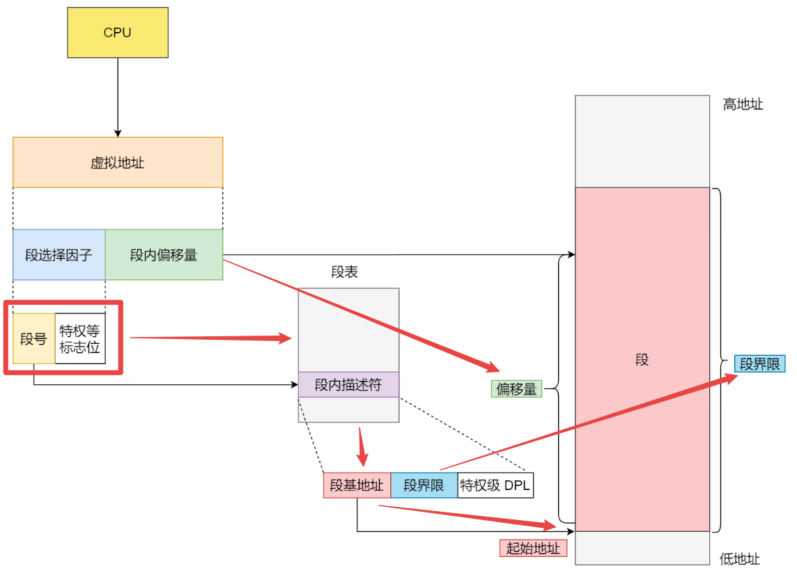

内存分段导致问题：**内存碎片**；

解决方案：

- 内存交换空间(`Swap`)：用来内存和硬盘的空间交换（`Swap Out`后再`Swap In`到紧连的物理地址，更新段表）

导致新问题：内存交换效率低，因为硬盘读写速度慢

新的解决方案：**内存分页**


### 分页

查询机制和上面的段表类似：页号、页内偏移量、页表中（虚拟页号->物理页号）

分页：将整个虚拟内存和物理地址空间切成固定尺寸大小，Linux下`4KB`，通过`页表`对应

- 缺页异常：进程的虚拟地址查不到时抛出，MMU分配物理内存并更新页表，再返回用户空间恢复进程
- 如何解决：页之间没空隙，内存不够时，只会少数的几页做`Swap Out`和`Swap In`操作

缺点：

- 浪费内存，不足4KB的数据也占一页
- 一个页表项需要`4Byte`存储，占用内存（对于`4G`的寻址空间要创建100万个页表项，占用相当大内存空间）
- 解决：**多级页表**

多级页表如何解决的：

- **局部性原理**，二级表不会在初始化时就创建，而是用到时再创建，初始化只需要一个一级页表即可覆盖到所有的内存地址（之前`4G`的需要100万个页表）

**32位系统的多级页表**

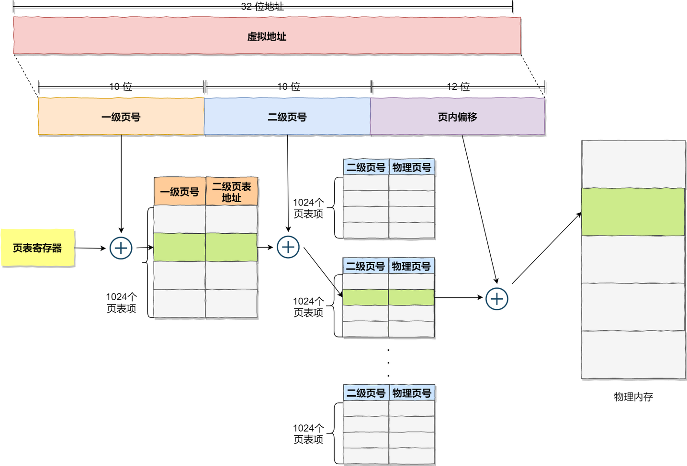

**64位系统的多级页表**

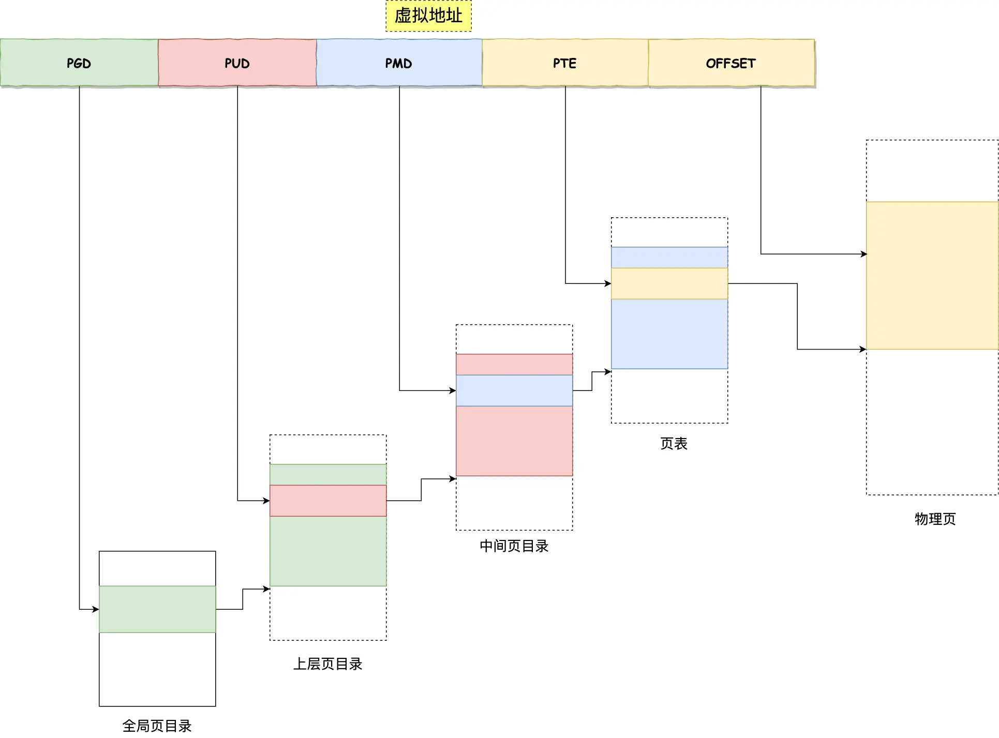

- 全局页目录项 PGD（*Page Global Directory*）；
- 上层页目录项 PUD（*Page Upper Directory*）；
- 中间页目录项 PMD（*Page Middle Directory*）；
- 页表项 PTE（*Page Table Entry*）；

### 段页式

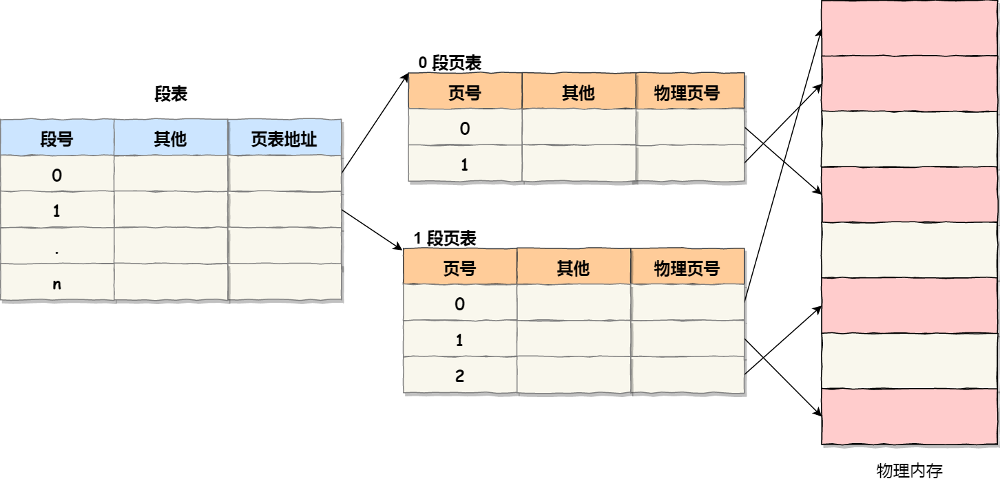

步骤：

- 第一次访问段表，得到页表起始地址；
- 第二次访问页表，得到物理页号；
- 第三次将物理页号与页内位移组合，得到物理地址。

优势：
- 相比分页式，段页式在初始化时不需要再创建页表，只需要创建段表即可，节省内存空间


## TLB

TLB（Translation Lookaside Buffer） ，通常称为页表缓存、转址旁路缓存、快表等

将最经常访问的页表项放入TLB中

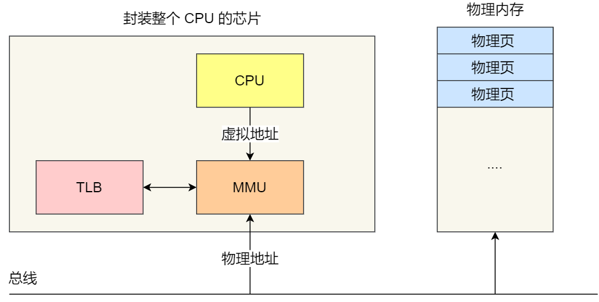


## 内存回收

### 分类

#### 按同步和异步

- **后台内存回收**(kswapd)：异步非阻塞
- **直接内存回收**(direct reclaim)：同步阻塞
- 如果上述无法解决，则会触发OOM机制：杀死占用物理内存较高的进程，直至释放足够内存

#### 按回收类型

- **文件页**：包括内核缓存的磁盘数据（Buffer）和内核缓存的文件数据（Cache）。回收干净页可以直接释放内存，回收脏页需要先写回磁盘再释放（会触发IO，影响性能）
- **匿名页**：没有堆、栈等实际载体，并且这部分内存可能被再次访问。回收这部份需要依靠**Linux的Swap机制**（会触发IO），将其写到磁盘后释放该部分内存，用到时再从磁盘读取

### LRU算法

维护了两个双向链表，分别是（**越接近尾部表示越不经常访问，优先回收不经常访问的内存**）：

- **active_list** 活跃内存页链表，这里存放的是最近被访问过（活跃）的内存页；
- **inactive_list** 不活跃内存页链表，这里存放的是很少被访问（非活跃）的内存页；

### 回收阈值

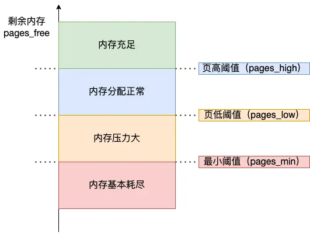

- 超出`pages_low`触发后台内存回收(kswapd)，异步非阻塞
- 超出`pages_min`触发直接回收，同步阻塞


## 内存空间分布

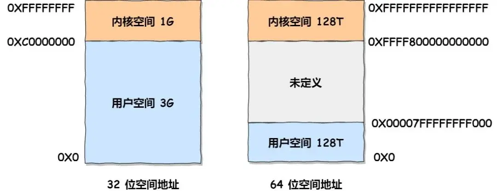

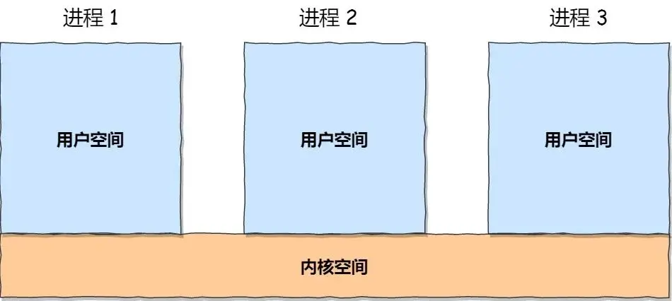


### 用户空间

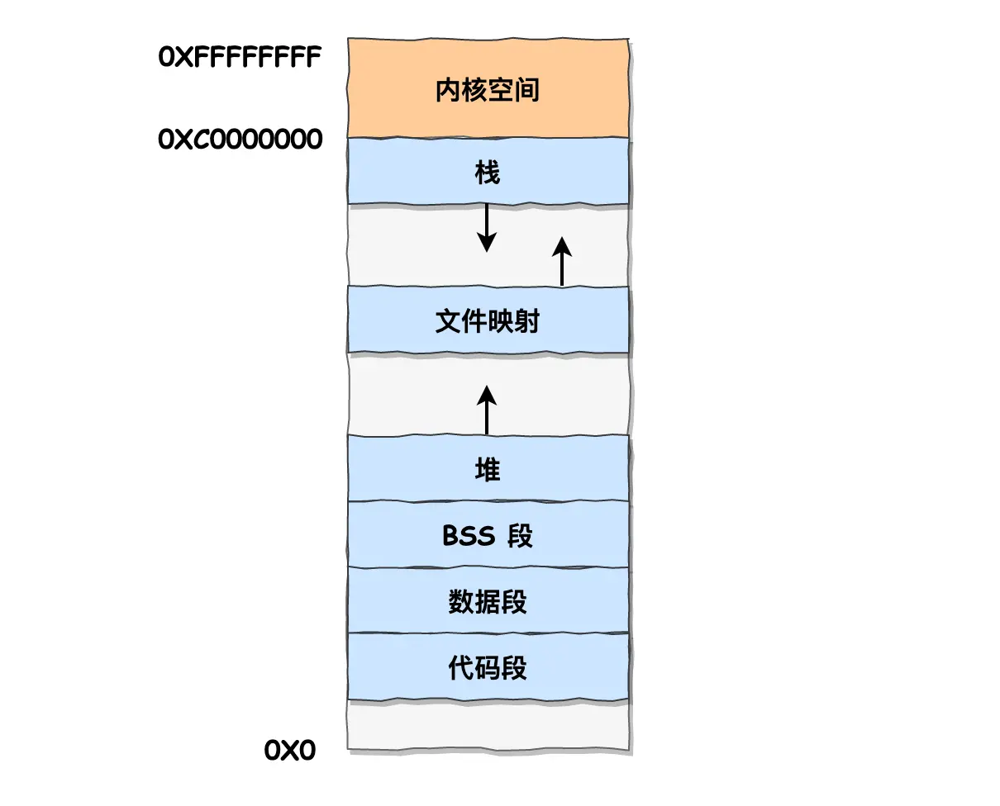

- 代码段，包括二进制可执行代码；
- 数据段，包括已初始化的静态常量和全局变量；
- **BSS 段**，包括未初始化的静态变量和全局变量；
- 堆段，包括动态分配的内存，从低地址开始向上增长；
- **文件映射段**，包括动态库、共享内存等，从低地址开始向上增长；
- 栈段，包括局部变量和函数调用的上下文等。栈的大小是固定的，一般是 8 MB。

堆和文件映射段的内存是动态分配的

# 进程管理

## 进程状态

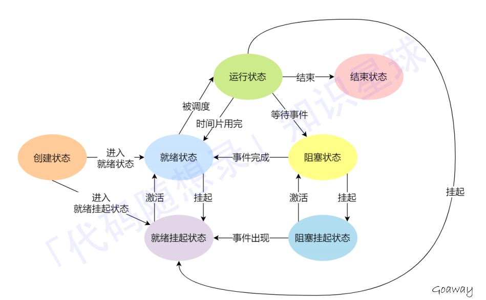

- 挂起是避免阻塞状态的程序占用内存，而将其物理内存空间换出到硬盘，等阻塞结束后再读取到内存中

区分**阻塞挂起**和**就绪挂起**两种状态：

- 两者都在外存，阻塞挂起需等待某个事件(例如IO完成)，而就绪挂起只要进入内存后就立即运行


## 上下文切换

### PCB、TCB

Process/Thread Control Block，用来对进程/线程进行唯一标识

**PCB：**

- 由操作系统维护，包括进程描述、控制、资源分配等信息，以及CPU相关信息

**TCB：**

- 用户线程：
    - 不由操作系统维护，线程之间的中断必须通过进程进行（这样其他进程都会被停止）
- 内核线程：
    - 由操作系统维护，线程之间的中断互不影响，缺点是对系统开销大

### 轻量级进程


轻量级进程（**Light-weight process，LWP**）与内核进程**一对一**，与普通进程的区别是只有一个最小的执行上下文和调度程序所需的统计信息

**`1:1`：**

- 优点：用户线程之间不会互相阻塞
- 缺点：系统开销大

**`N:1`：**

- 优点：用户线程的上下文切换在用户空间，切换效率高

> 为什么切换效率高？因为`1:1`时候**上下文的切换发生在内核空间**，从用户空间切换到内核空间需要进行用户态和内核态的切换，这其中包含了复杂的操作

- 缺点：用户线程之间会互相阻塞

**`N:M`：**

- 综合了前两者的优点


## 进程调度

- 非抢占式调度：挑选一个进程，直到该进程阻塞或退出，才会调度另一个进程
- 抢占式调度：挑选一个进程，在时间片末发生中断，将CPU权限返回给调度程序来调度另一个进程

### 调度原则

- 发生IO等CPU利用率低的事件
- 提高系统**吞吐率**（CPU单位时间内完成的进程比例），调度程序需权衡长进程和短进程
- **周转时间**（进程运行时间、阻塞时间和等待时间之和）。调度程序要平衡等待时间长而运行时间短的进程
- 根据就绪队列中的等待时间，对于等待时间长的任务优先调用
- 响应时间，响应时间短的任务优先调用

### 调度算法
- FCFS(First Come First Serve)
- SJF(Shortest Job First)
- HRRN(Highest Response Ratio Next)
  - 选择响应比对的任务调度
  - 响应比 = （等待时间 + 估计运行时间）/ 估计运行时间 
- RR(Round Robin)
  - 轮询，每个进程分配同样的时间片
- HPF(Highest Priority First)
  - 有静态优先级和动态优先级两种；
  - 静态优先级在创建时确定，运行期间不变；动态优先级与进程的运行时间成反比，等待时间成正比
- Multilevel Feedback Queue

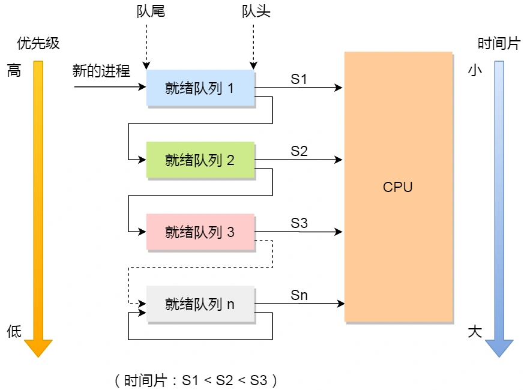
  > 高优先级的进程时间片会很短，新的进程会先进入第一梯队，如果在S1处没完成，则会进入第二梯队，而第二梯队虽然优先级低但是有更高的时间片段时间，这样有效的在高优先级完成了短任务，而长任务就可以往下依次挪到低优先级但时间片段更大的队列

# Linxu 命令
## awk
**内置变量:**

- NF 字段个数，（读取的列数）
- NR 记录数（行号），从1开始，新的文件延续上面的计数，新文件不从1开始
- FNR 读取文件的记录数（行号），从1开始，新的文件重新从1开始计数
- FS 输入字段分隔符，默认是空格
- OFS 输出字段分隔符 默认也是空格
- RS 输入行分隔符，默认为换行符
- ORS 输出行分隔符，默认为换行符