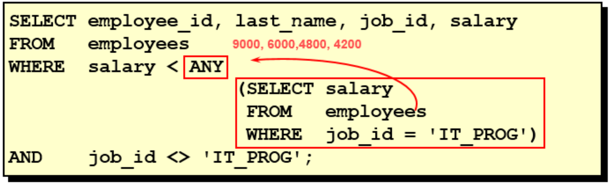
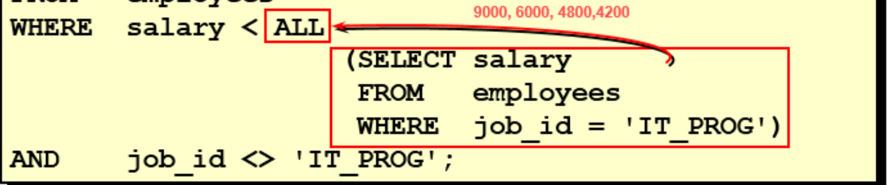
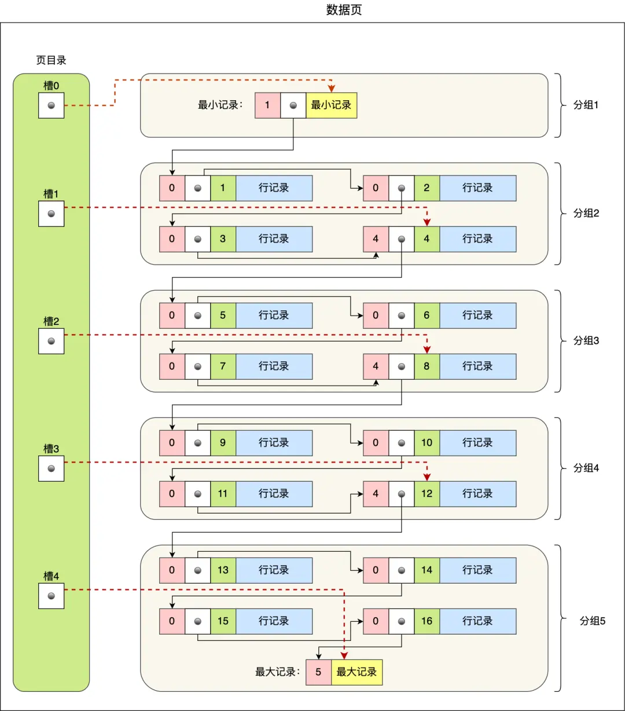
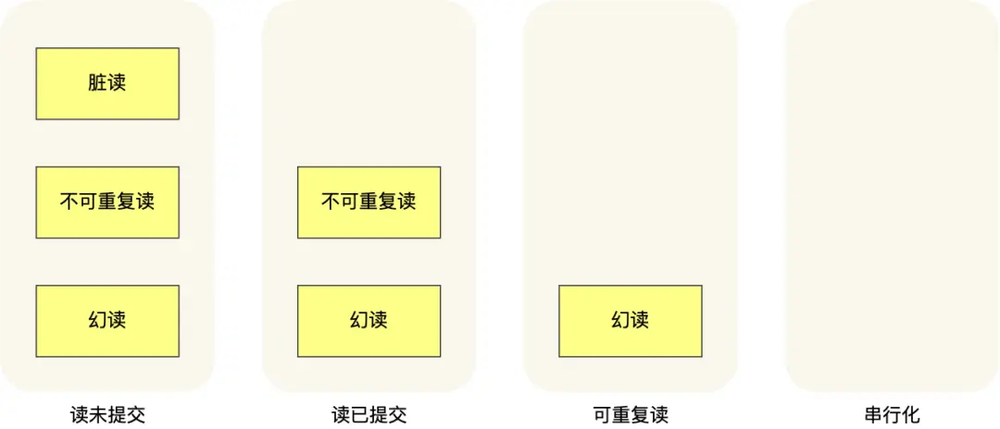
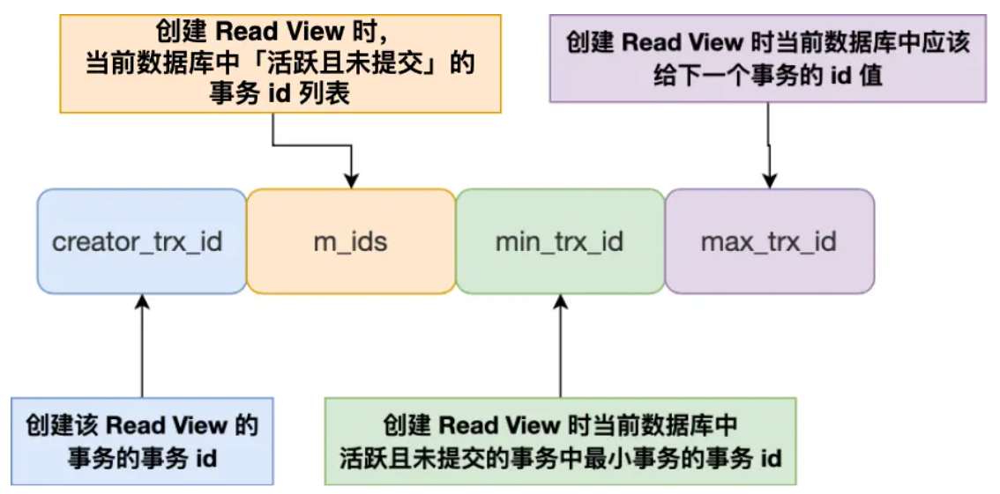
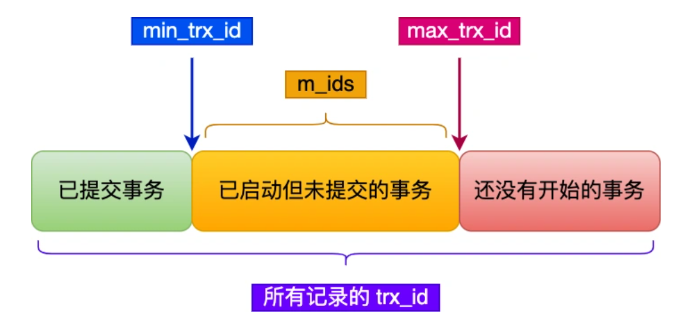

- [SQL基本概念](#sql基本概念)
  - [SQL语言分类](#sql语言分类)
  - [表的连接](#表的连接)
  - [WHERE 和 HAVING的区别](#where-和-having的区别)
  - [子查询](#子查询)
    - [单行子查询](#单行子查询)
    - [多行子查询](#多行子查询)
    - [结合`EXISTS`使用](#结合exists使用)
  - [约束性](#约束性)
    - [非空约束](#非空约束)
    - [唯一约束](#唯一约束)
    - [主键约束](#主键约束)
    - [外键约束](#外键约束)
  - [约束等级](#约束等级)
  - [面试问题](#面试问题)
- [InnoDB](#innodb)
  - [数据页](#数据页)
- [事务](#事务)
  - [并发事务的问题](#并发事务的问题)
  - [特性](#特性)
  - [隔离级别](#隔离级别)
  - [Read View](#read-view)
- [MySQL8新特性](#mysql8新特性)
  - [DDL 原子性](#ddl-原子性)
  - [计算列](#计算列)
  - [自增列持久化](#自增列持久化)

# SQL基本概念

## SQL语言分类

- DDL（Data Definition Language）：数据定义语言，用于定义数据库对象，如表、索引等，常见包括：
  - `CREATE TABLE`, `ALTER TABLE`, `DROP TABLE`, `CREATE INDEX`, `DROP INDEX`
- DML（Data Manipulation Language）：数据操作语言，用于对数据库中的表进行增删改查操作,常见SQL语句包括
  - `INSERT`, `UPDATE`, `DELETE`, `SELECT`
- DCL（Data Control Language）：数据控制语言，用于定义数据库的访问权限和安全级别，常见包括：
  - `GRANT`, `REVOKE`, `COMMIT`, `ROLLBACK`, `SAVEPOINT`, `LOCK TABLE`

## 表的连接

- 笛卡尔积（CARTESIAN PRODUCT）：两个表的所有行的组合，例如

    ```sql
    SELECT * FROM A, B;
    ```

- 内连接（[INNER] JOIN）：返回两个表中**符合连接条件**的记录，例如

    ```sql
    SELECT * FROM A INNER JOIN B ON A.id = B.id;
    ```

- 左连接（LEFT [OUTER] JOIN）：返回左表中**符合连接条件**的记录，即使右表中没有符合条件的记录，也会返回左表中的记录，例如

    ```sql
    SELECT * FROM A LEFT JOIN B ON A.id = B.id;
    ```

> 右连接（RIGHT [OUTER] JOIN）：和左连接类似，只是方向反了过来，即使左表中没有符合条件的记录，也会返回右表的内容

- 全连接（FULL JOIN）：返回左表和右表中**符合连接条件**的记录，即使左表或右表中没有符合条件的记录，也会返回左表或右表中的记录，例如

    ```sql
    SELECT * FROM A FULL JOIN B ON A.id = B.id;
    ```

- 自连接（SELF JOIN）：表连接自身，例如

    ```sql
    SELECT * FROM A AS a1, A AS a2 WHERE a1.id = a2.id;
    ```

- 多表连接：多个表之间的连接，例如

    ```sql
    SELECT * FROM A INNER JOIN B ON A.id = B.id INNER JOIN C ON B.id = C.id;
    ```

> 内连接和左右连接不同的是，内连接被连接的表都满足条件才返回，而左右连接只需要左/右表满足条件即可返回，不在乎右/左表是否满足条件

## WHERE 和 HAVING的区别

1. WHERE子句出现在SELECT语句的后面，而HAVING子句出现在GROUP BY语句的后面。
2. WHERE子句用于指定过滤条件，而HAVING子句用于指定**分组后**的过滤条件。
3. WHERE子句不能与聚合函数一起使用，而HAVING子句可以与聚合函数一起使用。例如

   ```sql
    HAVING MAX(num) > 1000; // 正确
    WHERE MAX(num) > 1000; // 错误
   ```

## 子查询

子查询即在查询语句中嵌套其他查询语句，分为单行子查询和多行子查询，下面重点讲解多行子查询。

### 单行子查询

例如：

```sql
SELECT * FROM A WHERE id = (SELECT id FROM B WHERE name = 'Tom');
```

后方被括号圈起来的部分，就是子查询，因为只有一个子查询所以称为单行子查询

### 多行子查询

**多行比较作符号**:

| 符号 | 说明 |
| --- | --- |
| IN | 等于列表中的任意一个 |
| ANY | 与子查询中的任意一个值进行比较 |
| ALL | 与子查询中的所有值进行比较 |
| SOME | 与ANY作用相同 |

例如：



- 只要满足`salary`小于[9000,6000,4800,4200]中任意一个值，`WHERE`条件成立



- `salary`要小于[9000,6000,4800,4200]中所有的值，`WHERE`条件才成立

### 结合`EXISTS`使用

- 子查询存在满足条件的行时：`EXISTS`返回`TRUE`
- 子查询不存在满足条件的行时：`EXISTS`返回`FALSE`

## 约束性

约束是对表中数据的规定，可以在创建表(`CREATE TABLE`)时定义，也可以在表创建后再定义(`ALTER TABLE`)。

例如：

通过`CREATE TABLE`创建表时定义约束：

```sql
CREATE TABLE A (
    id INT NOT NULL,
    name VARCHAR(20) NOT NULL,
    PRIMARY KEY (id)
);
```

通过`ALTER TABLE`创建表后定义约束：

```sql
-- 添加非空约束
ALTER TABLE 表名 MODIFY 字段名 数据类型 NOT NULL;
-- 删除非空约束，把NOT去掉即可
ALTER TABLE 表名 MODIFY 字段名 数据类型 NULL;
```

常见的表约束有：

- NOT NULL 非空约束，规定某个字段不能为空
- UNIQUE 唯一约束，规定某个字段在整个表中是唯一的
- PRIMARY KEY 主键(非空且唯一)约束
- FOREIGN KEY 外键约束
- CHECK 检查约束
- DEFAULT 默认值约束

### 非空约束

### 唯一约束

唯一约束可以指定单列，也可以通过组合的方式指定多列，例如：

```sql
-- 给NAME和PASSWORD的组合添加唯一约束
CREATE TABLE USER(
   id INT NOT NULL,
   NAME VARCHAR(25),
   PASSWORD VARCHAR(16),
   -- 使用表级约束语法
   -- uk_name_pwd是约束的名称，可以随便取
   CONSTRAINT uk_name_pwd UNIQUE(NAME,PASSWORD) 
);
```

> MySQL会给唯一约束的列上默认创建一个唯一索引。这样可以提高查询效率

### 主键约束

等同于唯一约束+非空约束，可以指定单列或者**多列(组合)**

**自增列**

对应关键字：`AUTO_INCREMENT`

一个表中只能有一个自增列，且必须是主键列或者唯一键列

> MySQL8.0后添加了[自增列持久化特性](#自增列持久化)

### 外键约束

使用外键约束的称为从表(子表)，被引用的表成为主表(父表)，如下所示：

```sql
create table dept( --主表 
  did int primary key, --部门编号 
  dname varchar(50) --部门名称 
);
  
create table emp(--从表 
  eid int primary key, --员工编号 
  ename varchar(5), --员工姓名 
  deptid int, --员工所在的部门
  foreign key (deptid) references dept(did) --在从表中指定外键约束 
);

-- 说明： 
--   （1）主表dept必须先创建成功，然后才能创建emp表，指定外键成功。 
--   （2）删除表时，先删除从表emp，再删除主表dept
```

**特点**：

1. 主表中被外键约束引用的列，必须是主键或者唯一键
2. 创建时先主表再从表，删除时先从表再主表
3. 一个表可以有多个外键约束

如果想要在建表后添加外键约束，格式如下：

格式：

```sql
ALTER TABLE 从表名 ADD [CONSTRAINT 约束名] FOREIGN KEY (从表的字段) REFERENCES 主表名(被引用 字段) [on update xx][on delete xx];
```

例如：

```sql
ALTER TABLE emp1 ADD [CONSTRAINT emp_dept_id_fk] FOREIGN KEY(dept_id) REFERENCES dept(dept_id);
```

**外键约束的缺点**

外键约束只适用于**单机低并发**场景，在**分布式**和**高并发**场景不适用；尤其是使用`Cascade`(级联)时，因为级联更新是强阻塞，存在数据库`更新风暴`的风险。同样外键还影响数据库的插入效率。

因此外键约束应该建立在`应用层`面，来保证数据一致性同时减少外键带来的效率低下和其他风险。


## 约束等级

- `Cascade` ：在父表上update/delete记录时，同步update/delete掉子表的匹配记录
- `Set null`：在父表上update/delete记录时，将子表上匹配记录的列设为null，但是要注意子
表的外键列不能为not null
- `No action` ：如果子表中有匹配的记录，则不允许对父表对应候选键进行update/delete操作
- `Restrict`：同no action， 都是立即检查外键约束
- `Set default`（在可视化工具SQLyog中可能显示空白）：父表有变更时，子表将外键列设置成一个默认的值，但Innodb不能识别

如果不指定等级，默认为`Restrict`。指定等级的例子如下：

```sql
...
foreign key (deptid) references dept(did) on update cascade on delete set null
```

上述程式指定了指向`dept`表的`did`列的外键约束`deptid`的约束等级，在`UPDATE`操作上约束等级为`Cascade`，在`DELETE`操作上约束等级为`Set null`。

## 面试问题

**Q: 为什么一般不使用`null`值？**

建表的时候通常会用`not null default ''`或`default 0`来杜绝使用`null`值，原因是：

1. `null`值在索引中不起作用，会导致索引失效，这样检索只能通过比较其他键值，降低检索效率
2. `null`值只能用专门的`is null`和`is not null`来比较，如果用运算符比较通常会返回`null`而不是布尔值。

# InnoDB

## 数据页

InnoDB的数据是按照「**数据页**」为单位读写，默认大小为**16KB**，包含有7个部份，如右图所示，其中：


- File Header有两个指针，分别指向上个和下个数据页，形成**双向链表**
- 数据页中的行记录按照「主键」顺序形成**单向链表**，为了提高检索效率，因此加入了「页目录」

**页目录**

如右图所示

1. 将所有的记录划分成几个组，这些记录包括最小记录和最大记录，但**不包括标记为“已删除”的记录；**
2. 每个记录组的最后一条记录就是组内最大的那条记录，并且最后一条记录的头信息中会存储该组一共有多少条记录，作为 n_owned 字段（右图中粉红色字段）
3. 页目录用来存储**每组最后一条记录的地址偏移量**，这些地址偏移量会按照先后顺序存储起来，每组的地址偏移量也被称之为槽（slot），**每个槽相当于指针指向了不同组的最后一个记录**。



# 事务

## 并发事务的问题

- 脏读：一个事务「读到」了另一个「未提交事务修改过的数据」
- 不可重复读：在**一个事务内**多次读取同一个数据，如果出现**前后两次读到的数据不一样**的情况。
- 幻读：在一个事务内多次查询某个符合查询条件的「记录数量」，如果出现前后两次查询到的记录数量不一样的情况。

> 区分幻读和不可重复读
A：幻读是指查询的**记录数量**前后不同，不可重复读是指**具体数据值**的前后不同
>
## 特性

**概念：**

- **原子性（Atomicity）**：一个事务要么完成要么不完成
- **一致性（Consistency）**：是指事务操作前和操作后，数据满足完整性约束，数据库保持一致性状态。
- **隔离性（Isolation）**：每个事务都有一个完整的数据空间，对其他并发事务是隔离的。
- **持久性（Durability）**：事务处理结束后，对数据的修改就是永久的，即便系统故障也不会丢失。

**如何保证：**

- 持久性是通过 redo log （重做日志）来保证的；
- 原子性是通过 undo log（回滚日志） 来保证的；
- 隔离性是通过 MVCC（多版本并发控制） 或锁机制来保证的；
- 一致性则是通过持久性+原子性+隔离性来保证；

## 隔离级别

**概念**

级别越高，性能越低

- **读未提交（read uncommitted）**：指一个事务还没提交时，它做的变更就能被其他事务看到；
- **读提交（read committed)**：指一个事务提交之后，它做的变更才能被其他事务看到；
- **可重复读（repeatable read）**：指一个事务执行过程中看到的数据，一直跟这个事务启动时看到的数据是一致的，**MySQL InnoDB 引擎的默认隔离级别**；
- **串行化（serializable）**：会对记录加上读写锁，在多个事务对这条记录进行读写操作时，如果发生了读写冲突的时候，后访问的事务必须等前一个事务执行完成，才能继续执行；



不同隔离级别会出现的并发问题

**实现**

- 读未提交：不加锁直接读
- 读提交：通过**ReadView**实现，在「每个语句执行前」都重新生成一个ReadView
- 可重复读：「启动事务时」生成一个ReadView
- 串行化：加读写锁进行访问，同一时刻只允许一个线程读取

## Read View

需要了解的：

- Read View四个字段的作用
- 聚簇索引记录中两个跟事务有关的隐藏列

**四个字段的作用**



- **creator_trx_id**：当前事务的ID
- **m_ids**：当前事务启动时，系统中所有「活跃但未提交」事务的ID
- **min_trx_id**: 当前事务启动时，系统中所有「活跃但未提交」事务中**最小**ID
- **max_trx_id**: 同上，但是**最大**ID

**MVCC**

中文名：多版本并发控制

根据当前事务的`min_trx_id`和`max_trx_id`，我们可以讲对于当前事务的其他事务划分为三类，如下图所示：



- 「已提交事务」，即小于`min_trx_id`，是对当前事务**可见**的;
- 「还没开始事务」，即大于`max_trx_id`，是对当前事务**不可见**的
- 「已启动未提交事务」，即在`min_trx_id`和`max_trx_id`之间，需要判断这个事务的`trx_id`是否在`m_ids`
  - 如果在，说明该事务还未提交，是对当前事务**不可见**的
  - 如果不在，说明该事务已经提交，是对当前事务**可见**的

# MySQL8新特性

## DDL 原子性

例如数据库中存在表`book1`，但是执行删除操作：

```sql
DROP TABLE book1, book2;
```

- 在 MySQL 8之前，虽然不存在`book2`会报错，但是`book1`表也会被删除；
- 而在 MySQL 8中，为保证事务完整性，即**DDL要么操作成功要么回滚**，因此在报错无法找到`book2`后，会发生事务回滚，这样`book1`就不会被删除

## 计算列

计算列指该列是通过其他列计算得到。MySQL8中支持创建表格的时候直接定义计算列，例如：

```sql
CREATE TABLE t1 (
    a INT,
    b INT,
    c INT AS (a + b) VIRTUAL
);
```

## 自增列持久化

MySQL8中支持将自增列的值持久化到磁盘中，这样在重启数据库后，自增列的值不会被重置。

当主键id是[1,2,3,4]时，删除id=4的行数据后，再次添加一行数据，id会从5开始，而不是4。

由于MySQL5.7的计数器只在内存中进行维护，重启数据库中再次添加数据时，会从id=4开始。而MySQL8.0对自增列的计数器也进行了持久化，即使重启数据库，也会从id=5开始添加。
