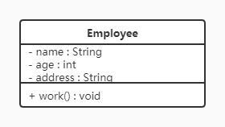
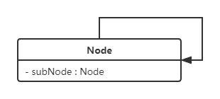
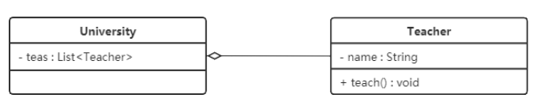
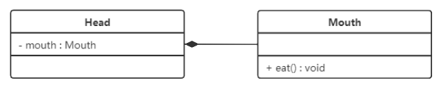
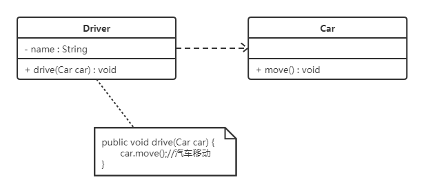

- [UML图](#uml图)
  - [类图](#类图)
    - [关联关系](#关联关系)
    - [聚合关系](#聚合关系)
    - [组合关系](#组合关系)
    - [依赖关系](#依赖关系)
- [七大原则](#七大原则)
  - [单一职责原则](#单一职责原则)
  - [接口隔离原则](#接口隔离原则)

# UML图
UML：Unified Modeling Language，即统一建模语言，用于描述软件系统中的静态结构和动态行为。

UML图包括类图、例图、对象图、状态图、活动图、时序图、协作图、构件图、部署图等9种图

## 类图
显示了模型中存在的类、类的内部结构以及与其他类之间的关系

- +：表示public
- -：表示private
- #：表示protected

类之间存在不同的关系，如关联关系、聚合关系、组合关系、依赖关系、泛化关系、实现关系等，类图中对他们的不同表现方式如下所述。

### 关联关系
首先介绍强关联关系，都是由实线和实心箭头表示，可分为单向关联、双向关联和自关联，其中双向关联不存在箭头符号，自关联如下图所示

### 聚合关系
聚合关系是一种弱的关联关系，体现的是A对象可以包含B对象，但B对象不是A对象的一部分，通常由空心菱形表示，如下图所示

进一步解释，聚合关系是部份与整体之间的关系（例如一个机器由多个零件组成，机器是整体，零件是部份）；而关联关系是两个独立的类之间的关系，例如学生和老师之间的关系。

### 组合关系
是一种更强的聚合关系，在于整体对象可以控制部份对象的生命周期，一旦整体对象不存在，则部份对象也无法独立存在。通常由实心菱形表示：

### 依赖关系
是**临时性**的关联，耦合度最弱。例如计算器只会在计算学生GPA时调用学生类，计算完成之后他们之间的关系就解除了，因此学生类和计算器类是依赖关系。通常用虚线进行表示，如下图所示：

# 七大原则

## 单一职责原则

- 一个类只负责一项职责
- 目的：提高类的可读性、可维护性，降低变更风险

## 接口隔离原则

- 将大接口划分为精细的小接口，不能强迫代码依赖它不需要的接口
- 目的：提高代码灵活度、可扩展性和可维护性