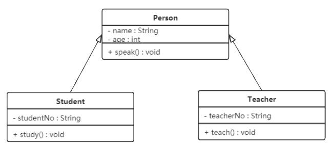
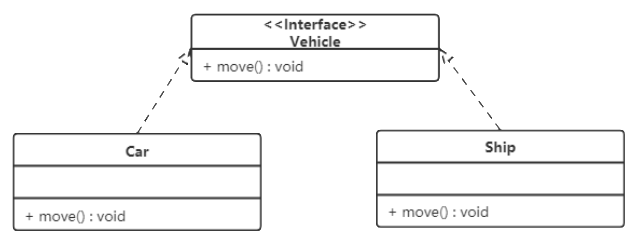
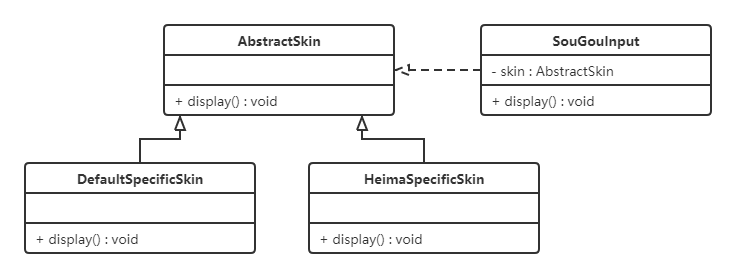
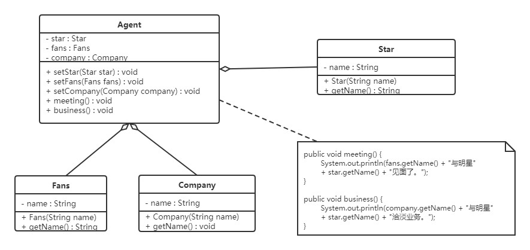
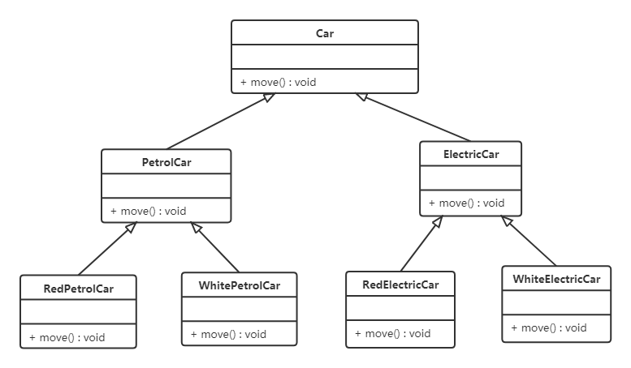
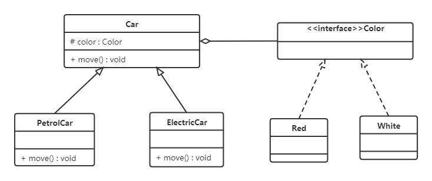

- [UML图](#uml图)
  - [类图](#类图)
    - [关联关系](#关联关系)
    - [聚合关系](#聚合关系)
    - [组合关系](#组合关系)
    - [依赖关系](#依赖关系)
    - [继承关系](#继承关系)
    - [实现关系](#实现关系)
- [七大原则](#七大原则)
  - [单一职责原则](#单一职责原则)
  - [接口隔离原则](#接口隔离原则)
  - [开闭原则](#开闭原则)
  - [里氏代换原则](#里氏代换原则)
  - [依赖倒置原则](#依赖倒置原则)
  - [迪米特法则](#迪米特法则)
  - [合成复用原则](#合成复用原则)
- [设计模式](#设计模式)
  - [创建者模式](#创建者模式)
    - [单例模式](#单例模式)


# UML图
UML：Unified Modeling Language，即统一建模语言，用于描述软件系统中的静态结构和动态行为。

UML图包括类图、例图、对象图、状态图、活动图、时序图、协作图、构件图、部署图等9种图

## 类图
显示了模型中存在的类、类的内部结构以及与其他类之间的关系


- +：表示public
- -：表示private
- #：表示protected

类之间存在不同的关系，如关联关系、聚合关系、组合关系、依赖关系、泛化关系、实现关系等，类图中对他们的不同表现方式如下所述。

### 关联关系
首先介绍强关联关系，都是由实线和实心箭头表示，可分为单向关联、双向关联和自关联，其中双向关联不存在箭头符号，自关联如下图所示


### 聚合关系
聚合关系是一种弱的关联关系，体现的是A对象可以包含B对象，但B对象不是A对象的一部分，通常由空心菱形表示，如下图所示


进一步解释，聚合关系是部份与整体之间的关系（例如一个机器由多个零件组成，机器是整体，零件是部份）；而关联关系是两个独立的类之间的关系，例如学生和老师之间的关系。

### 组合关系
是一种更强的聚合关系，在于整体对象可以控制部份对象的生命周期，一旦整体对象不存在，则部份对象也无法独立存在。通常由实心菱形表示：


### 依赖关系
是**临时性**的关联，耦合度最弱。例如计算器只会在计算学生GPA时调用学生类，计算完成之后他们之间的关系就解除了，因此学生类和计算器类是依赖关系。通常用虚线进行表示，如下图所示：


### 继承关系

是**耦合度最大**的一种，通常用实线加空心三角形表示，如下图所示：



### 实现关系

通常用空心三角加虚线表示，如下图：



# 七大原则

## 单一职责原则

- 一个类只负责一项职责
- 目的：提高类的可读性、可维护性，降低变更风险

## 接口隔离原则

- 客户端不能被迫依赖于它不使用的方法；应该将大接口划分为精细的小接口。
- 目的：提高代码灵活度、可扩展性和可维护性

## 开闭原则

- 对扩展开放，对修改关闭。核心思想是软件实体依赖的是接口或者抽象类，这样在拓展新功能时可以避免修改原有代码，而是通过实现接口或者继承抽象类来实现新功能。例如：

- 搜狗输入法的皮肤可以定义为一个抽象类，不同的皮肤可以继承该抽象类，这样在添加新的皮肤时，只需要继承该抽象类即可，而不需要修改原有代码。



## 里氏代换原则

- 子类可以扩展父类的功能，但不能改变父类原有的功能
- 如果重写父类的方法，整个继承体系的可复用性会很差，导致在多态频繁使用的场景下可能会出现问题(例如矩形的`resize`方法对长方形有效，对正方形会陷入死循环，详情见黑马讲义)。

## 依赖倒置原则

- 高层模块不应该依赖底层模块，二者都应该依赖其抽象
- 例如组装电脑，电脑的组装过程不应该依赖具体的品牌（如Intel CPU，金士顿内存、希捷硬盘等），而是依赖于品牌的抽象（即CPU、内存、硬盘等）。这样可以提高用户的灵活度，用户挑选的组件只需要实现接口的方法即可

## 迪米特法则

又称最少知识原则。即如果两个实体无须直接通信，那么就不用发生直接调用，可以通过第三发转发该调用。例如明星和代理人，明星不需要和粉丝、媒体公司等产生直接调用关系，而是交由代理人处理，如下图所示：



- 当明星需要和粉丝交流或和媒体公司开会，则可以通过代理人发起`meeting`或`business`方法

## 合成复用原则

尽量使用合成/聚合的方式，而不是使用继承，例如下图所示：



- 通过继承的关系将Car分为电车和油车，但是若要添加不同颜色的车型，则需要再次使用继承关系，大大降低了代码的复用性。因此将继承关系调整为聚合关系，如下图所示：



- 通过聚合关系，可以将颜色抽象为Car的一个接口，这样不需要在通过继承父类来添加不同颜色的车型，降低了系统的耦合度


# 设计模式

## 创建者模式

### 单例模式

包含两个角色：**单例类**、**访问类**，单例类指的是只能创建一个对象的类，访问类指的是通过单例类创建对象的类。例如：

```java
public class Singleton {
    private static Singleton instance = new Singleton();
    private Singleton() {}
    public static Singleton getInstance() {
        return instance;
    }
}
```

其中，`Singleton`类是单例类，`getInstance`方法是访问类，通过该方法可以获取到`Singleton`类的唯一实例。

**实现**

有两种实现：
- 饿汉式：单例类加载时就创建实例，线程安全，但是可能造成内存浪费
- 懒汉式：单例类加载时不创建实例，只有在第一次调用`getInstance`方法时才创建实例，线程不安全，需要加锁

1. 饿汉式

例如上面的代码块就是饿汉式，同样可以改写为静态代码块的初始方法，如下：

```java
public class Singleton {
    private static Singleton instance;
    static{
        instance = new Singleton();
    }
    private Singleton() {}
    public static Singleton getInstance() {
        return instance;
    }
}
```

还可以通过枚举方式实现，如下：

```java
public enum Singleton {
    INSTANCE;
}
```
> 枚举方式是单例实现中**唯一**不会被破坏的单例实现模式

2. 懒汉式

对于懒汉式的实现方法如下，在声明`Singleton`类时不会给`instance`赋值，而是在调用`getInstance`方法后才赋值。但是这种实现方法是线程不安全的，因此需要加锁，如下：

```java
public class Singleton {
    private static Singleton instance;
    private Singleton() {}
    public static synchronized Singleton getInstance() {
        if (instance == null) {
            instance = new Singleton();
        }
        return instance;
    }
}
```

a. **双重检查锁方式**

但是对于`getInstance`来说绝大部分读操作，直接加锁的方式会让效率降低，因此需要调整加锁的时机，由此产生：**双重检查锁模式**，如下：

```java
public class Singleton {
    private static Singleton instance;
    private Singleton() {}
    public static Singleton getInstance() {
        if (instance == null) {
            synchronized (Singleton.class) {
                if (instance == null) {
                    instance = new Singleton();
                }
            }
        }
        return instance;
    }
}
```

但是双重检查锁模式存在问题，即**指令重排**，在多线程环境下，由于编译器优化重排的缘故，有可能会出现`instance = new Singleton()`的执行顺序颠倒的情况，即先给`instance`赋值，再执行构造方法，这样就会导致`instance`不为空，但是对象还没有初始化完成，因此需要在`instance`前面加上`volatile`关键字，如下：

```java
public class Singleton {
    private static volatile Singleton instance;
    private Singleton() {}
    public static Singleton getInstance() {
        if (instance == null) {
            synchronized (Singleton.class) {
                if (instance == null) {
                    instance = new Singleton();
                }
            }
        }
        return instance;
    }
}
```

b. **静态内部类方式**

由于JVM在加载外部类时，不会加载**静态内部类**，因此可以通过静态内部类的方式实现单例模式，如下：

```java
public class Singleton {
    private Singleton() {}
    // 静态内部类只在调用getInstance时才会加载
    private static class SingletonHolder {
        private static final Singleton INSTANCE = new Singleton();
    }
    public static final Singleton getInstance() {
        return SingletonHolder.INSTANCE;
    }
}
```

**破坏单例模式**

除开枚举类创建单例模式，之前所说的其他几种方式都有可能被破坏单例模式，即创建多个对象，主要通过反射和序列化两种方式来破坏，如下：

1. 反射

```java
public class Test {
    public static void main(String[] args) throws Exception {
        Class clazz = Class.forName("Singleton");
        Constructor constructor = clazz.getDeclaredConstructor(null);
        constructor.setAccessible(true);
        // 通过反射调取getInstance方法，来返回多个不同对象
        Singleton s1 = (Singleton) constructor.getInstance();
        Singleton s2 = (Singleton) constructor.getInstance();
        System.out.println(s1 == s2);
    }
}
```

**解决方案**

- 通过在构造方法中添加判断，如果`instance`不为空，则抛出异常，如下：

```java
public class Singleton {
    private static Singleton instance;
    private Singleton() {
        // 在构造方法中加入判断，禁止反射调用
        if (instance != null) {
            throw new RuntimeException("单例模式禁止反射调用");
        }
    }
    ...
}
```

2. 序列化

序列化将对象转换为字节序列的过程，而反序列化则是将字节序列恢复为对象的过程，同时反序列化时会通过反射机制调用无参构造方法来一个新的对象，这样就破坏了单例模式

**解决方案**

- 重写`readResolve`方法，如下：

```java
public class Singleton implements Serializable {
    private static final long serialVersionUID = 1L;
    private static Singleton instance;
    private Singleton() {}
    public static Singleton getInstance() {
        if (instance == null) {
            synchronized (Singleton.class) {
                if (instance == null) {
                    instance = new Singleton();
                }
            }
        }
        return instance;
    }
    // 反序列化时返回之前创建的单例对象
    private Object readResolve() {
        return instance;
    }
}
```

> 为什么序列化不能破坏枚举方式的单例模式？
>
> A：因为枚举类在反序列化时会调用`readResolve`方法，而枚举类没有`readResolve`方法，因此不会创建新的对象